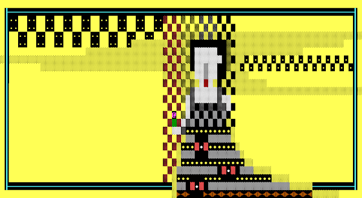

# corruptions.io

A site for [corruption(s*)](https://opensea.io/collection/corruption-s), a community-driven collaborative game on Ethereum.

Generated with [Hugo](https://gohugo.io) with CI/CD on [Netlify](https://netlify.com)

Local development: `npm start`

> I don't usually frontend, so if something feels janky, it probably is (:
